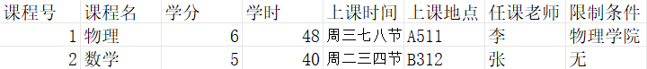

# 2024 年暑期 选课系统开发（基础）

## 运行环境
Target: x86_64-w64-mingw32  
GCC=11.2.0

## 目录

一、基础目标  
二、数据结构  
三、对象  
四、实现的操作  

## 一、基础目标
实现基础的选课功能，学生可以通过课程号、课程名进行快速选课，界面中点击选课用QT做更方便，实际方法一样，不在此实现    
老师登录后可以查看自己任课有哪些，可以查看班级学生情况，可以对学生进行增删改查操作  
管理员可以增删改查课程和学生的信息  
暂时不采用数据库管理，在本地使用txt进行数据管理，后续可能会接入数据库   

## 二、数据结构
整个数据相当于一个二维向量，同一行的是同一课程的不同信息，同一列的是不同课程的同一信息，如下图所示，实际上就是数据库的基本结构  
  
那么就可以采用STL库中的vector结构进行初步设计，用来简化数据结构 

## 三、对象
如上所说，我们需要创建课程类和用户类，课程类中的课程信息为各个数据，用户类中有管理员，老师，学生三种对象，他们拥有不同的权限，可以不同程度地对课程数据进行操作  

## 四、实现的操作

### 管理员：
1.登录操作  
2.查看自己的相关信息    
3.查看自己的消息箱  
4.增删改查课程  
5.对某一课程的学生进行增删改查  
6.退出操作  

### 老师：
1.查看自己的相关信息    
2.进入查看自己的任课信息    
3.对所任课程的学生的增删改查操作    
4.对所任课程的学生的集体通知操作，消息发送至学生的消息箱(采用txt存储)   
5.查看自己的消息箱  
6.退出操作

### 学生：
1.查看自己的相关信息    
2.进行选课操作  
3.进行退课操作  
4.提交系统错误信息或者需求信息到管理员的消息箱(采用txt存储)    
5.查看自己的消息箱  
6.退出操作  
